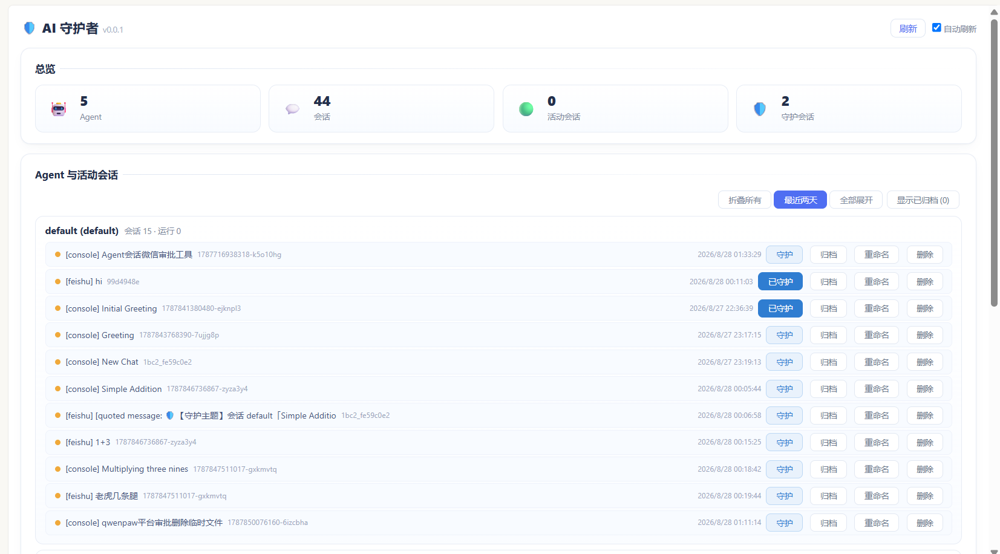
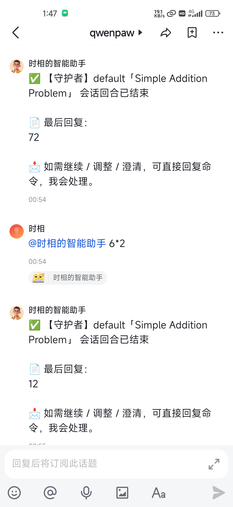

# qwenpaw-guard · AI 守护者

监督看护工具（QwenPaw 插件）。把「监督者」换成你的**飞书话题群会话**——
你在飞书里远程审批敏感操作、接收守护通知，并可在各个守护话题下分别回复续任务。

> 通知/审批频道的默认值为**飞书**。

## 功能

1. **列出所有 agent 与活动会话**（REST `GET /api/qwenpaw-guard/status` + 看板 `/apps/qwenpaw-guard`）
2. **会话结束通知**：被守护 agent 结束时，向飞书推送到该会话的专属主题帖（标题为会话名称）
3. **异常中断通知**：run 异常终止（工具取消/管线异常）时兜底推送
4. **需要权限钩子**：敏感工具调用被拦截，自动向飞书发审批请求；飞书回复「允许/拒绝」→ 放行/拒绝；超时或未配置目标默认拒绝（安全优先）
5. **多守护会话分别回复**：每个守护会话在话题群有专属主题帖；在对应主题下回复 → 按会话名称（优先）/ 话题 `thread_id` 兜底反查，归回被守护的原始会话并继承上下文
6. **话题回复转投 Console**：守护话题回帖默认转投到被守护会话的 console 渠道，由控制台身份续上下文、回复走控制台
7. **飞书话题群自动检测**：看板「🔍 自动检测」自动填入唯一话题群（多个则下拉选择），不硬编码群 ID
8. **会话名称显示**：通知正文/主题帖标题用可读会话名替代 `session_id`
9. **飞书侧命令**：`guard_status` / `guard_resolve` / `guard_configure` / `guard_send`

## 目录结构

```
qwenpaw-guard/
├── plugin.json          # 插件清单（版本、入口、权限）
├── plugin.py            # 入口：注册 stop/middleware/hooks/tools/router + resolver/redirect 注入
├── guard/
│   ├── constants.py     # 默认配置、通知频道、敏感规则、审批判定词
│   ├── store.py         # 配置 + 待审批 + 守护/归档会话 + 事件日志
│   ├── monitoring.py    # 列出 agent/活动会话；会话名称解析
│   ├── notifier.py      # 飞书话题群通知（list_topic_chats / send_text / send_test_message）
│   ├── middleware.py    # 需要权限钩子（on_acting 拦截 + 审批路由）
│   ├── hooks.py         # 会话结束钩子 + 异常通知钩子 + thread_resolver + redirect
│   ├── router.py        # REST API
│   └── tools.py         # guard_* 工具
├── docs/core-patch.md   # 核心 feishu 扩展点补丁说明（若核心未内置）
├── ui/index.js          # 看板 React 组件
├── README.md
└── CHANGELOG.md
```

---

## 快速开始

### 第 1 步：安装插件

把 `qwenpaw-guard` 插件放到 QwenPaw 的插件目录下，然后重启服务。

```bash
# 示例：放入运行目录（以实际 QwenPaw 部署路径为准）
cp -r qwenpaw-guard $QWENPAW_HOME/plugins/
```

### 第 2 步：启用飞书频道

在 QwenPaw 的频道设置里启用 `feishu`。

### 第 3 步：建话题群，把机器人拉进群

我们要一个**话题群**（主题群）来放每个守护会话的专属主题帖，方便你分别回复。

1. 打开飞书 → 新建群聊 → 选择 **话题群（Topic）** 类型。
2. 把刚才的机器人**拉进这个群**。
3. **不用手填群 ID**：打开**看板 → 通知配置（飞书）**，点「🔍 自动检测」——
   - 只有 1 个话题群 → 插件**自动填好** `feishu_topic_chat_id`，点「保存」即可；
   - 有多个话题群 → 在下拉里选你要的那个，点「保存」。

### 第 4 步：核对核心扩展点（⚠️ 关键）

插件依赖核心 `feishu` channel 的两个**通用扩展点**（thread-resolver / redirect-hook）。
先确认你的核心是否已有：

```bash
grep -cE "add_thread_resolver|add_redirect_hook" \
  /path/to/qwenpaw/app/channels/feishu/channel.py
```

- **≥ 2**：核心扩展点已就绪，跳过本步。
- **0**：按 [`docs/core-patch.md`](docs/core-patch.md) 补丁给核心 `feishu/channel.py`
  添加扩展点（都是通用钩子，无人注册时飞书行为不变，不影响收发）。

> 补丁文档包含可供直接粘贴的完整代码与三处接线点说明。

### 第 5 步：验证

```bash
# 补丁后编译检查（应无输出）
python -m py_compile /path/to/qwenpaw/app/channels/feishu/channel.py

# 重启 QwenPaw，加载插件后日志应出现
#   qwenpaw-guard: feishu thread resolver injected
#   qwenpaw-guard: feishu redirect hook injected
# 用「测试发送」验证飞书话题群连通性。
```

---

## 对核心的最小改动

插件不修改核心的监听/发送逻辑，只在核心 `feishu/channel.py` 上追加**通用扩展点**：

| 扩展点 | 能力 | 若缺失 |
| --- | --- | --- |
| `add_thread_resolver` + `_apply_thread_resolvers` + `_thread_resolvers_match` | 多守护会话回复映射会话、跳过引用噪音 | 回帖不归回守护会话（仍正常回复） |
| `add_redirect_hook` + `_apply_redirect_hooks` + `_redirect_to_console` | 守护话题回帖转投 console | 转投禁用，回帖按飞书渠道处理 |

使用方法见 [`docs/core-patch.md`](docs/core-patch.md)。这些扩展点均只接受回调、异常全吞、无人注册时行为不变。

---

## 配置

### 通知/审批频道（飞书）

默认 `channel=feishu`。须配置飞书话题群（`feishu_topic_chat_id`）才会把守护通知发到话题群；未配置时审批默认拒绝、仅记日志。

- **看板**：`/apps/qwenpaw-guard` → 通知配置卡片点「🔍 自动检测」（唯一自动填入 / 多个下拉）→「保存」/「测试发送」
- **REST**：
  ```bash
  curl -X GET  http://<host>/api/qwenpaw-guard/discover-topics     # 自动检测话题群
  curl -X POST http://<host>/api/qwenpaw-guard/config \
    -H "Content-Type: application/json" \
    -d '{"channel":"feishu","feishu_topic_chat_id":"oc_xxx","send_mode":"reply"}'
  curl -X POST http://<host>/api/qwenpaw-guard/test-send -d '{}'   # 连通性验证
  ```
- **工具**：绑定飞书的 agent 可调用 `guard_configure(feishu_topic_chat_id="...")`

### 配置项（`plugin_data/qwenpaw-guard/config.json`）

| 键 | 默认 | 说明 |
| --- | --- | --- |
| `channel` | `feishu` | 通知/审批频道 |
| `target_user` | `""` | 飞书目标用户（未配置时自动复用固定会话） |
| `target_session` | `""` | 飞书目标会话（同上） |
| `feishu_topic_chat_id` | `""` | 飞书话题群 `oc_xxx`；由看板「自动检测」填入 |
| `send_mode` | `reply` | `reply`（回帖到该会话专属主题，默认）/ `new_topic`（每次新话题） |
| `timeout_secs` | `300` | 审批超时（秒），超时默认拒绝 |
| `enabled` | `true` | 总开关 |
| `notify_stop` | `true` | 会话结束时是否通知 |
| `notify_warn` | `true` | warn 级副作用是否通知 |

---

## 使用

### REST API

| 方法 | 路径 | 说明 |
| --- | --- | --- |
| GET | `/api/qwenpaw-guard/status` | 所有 agent + 会话 + 待审批 + 配置 |
| GET | `/api/qwenpaw-guard/config` | 读取配置 |
| POST | `/api/qwenpaw-guard/config` | 写配置 |
| GET | `/api/qwenpaw-guard/discover` | 发现飞书会话 |
| GET | `/api/qwenpaw-guard/discover-topics` | 自动检测飞书话题群 |
| GET | `/api/qwenpaw-guard/pending` | 待审批列表 |
| POST | `/api/qwenpaw-guard/approvals/{id}/resolve` | `{action:"approve"\|"reject"}` |
| POST | `/api/qwenpaw-guard/sessions/guard` | 守护一个会话 |
| POST | `/api/qwenpaw-guard/sessions/archive` | 归档会话 |
| POST | `/api/qwenpaw-guard/sessions/rename` | 重命名会话 |
| POST | `/api/qwenpaw-guard/sessions/delete` | 删除会话 |
| POST | `/api/qwenpaw-guard/admin/rearm` | 重置待审批 |
| GET | `/api/qwenpaw-guard/events` | 事件日志 |
| POST | `/api/qwenpaw-guard/test-send` | 连通性测试 |

### 工具（agent 可用）

| 工具 | 说明 |
| --- | --- |
| `guard_status` | 列出 agent/会话/待审批 |
| `guard_resolve(request_id, decision)` | 结清一条审批（允许/拒绝） |
| `guard_configure(...)` | 配置飞书话题群目标 |
| `guard_send(text)` | 向飞书发文本 |

---

## 审批流程

```
agent 调用敏感工具
   │  on_acting 拦截
   ▼
 命中 block 规则 ──► 生成 request_id + 飞书发审批消息
                         │
     agent 阻塞等待 ──────┤  飞书回复「允许 83f2a1c0 / 拒绝」
                         ▼
              守护侧调用 guard_resolve
                         │
                         ▼
              允许 → 放行原工具；拒绝/超时 → 拒绝（ToolResultState.DENIED）
```

> 未守护的会话命中 block 规则 → 直接拒绝，不发审批请求。审批等待最长为 `timeout_secs`。

## 多守护会话回复 & 转投

- 每个被守护会话在话题群内有**专属主题帖**（标题固化会话名）；该会话的结束/错误/审批通知都送进这同一主题帖。
- 用户在对应主题下回复 → 按「会话名」优先反查（`resolve_session_by_name`）、话题 `thread_id` 兜底（`resolve_thread_session`），把回复的会话 id 覆盖为被守护的原始会话，agent 加载其历史上下文。
- 守护话题回帖会**跳过被引用文本注入**（主题说明等噪音不进入上下文）。
- 守护话题回帖默认**转投到被守护会话的 console 渠道**，由控制台身份续上下文、回复走控制台（目标会话动态反查，非硬编码）。

## 敏感规则（默认）

| 规则 | 级别 | 命中示例 |
| --- | --- | --- |
| `recursive_force_delete` | block | `rm -rf`、递归删除 |
| `disk_destroy` | block | `mkfs`、`fdisk`、`shutdown`、`reboot` |
| `force_push` | warn | `git push --force` |
| `write_other_workspace` | warn | 写其他 workspace |
| `external_side_effect` | warn | send_email / deploy / publish |

可在 `guard/constants.py` 调整 `SENSITIVE_RULES` 与 `LOG_IGNORE_TOOLS`。

## 说明与限制

- 中间件对所有 agent 生效；每次工具调用都会记录事件。
- 审批等待最长为 `timeout_secs`（默认 300s），期间该 agent 该次调用阻塞。
- 未配置飞书话题群时，block 级操作默认拒绝，避免「静默放行」。
- 飞书侧需能收到话题群内回复：要 **@机器人**，或给应用 `cli_aa050fee55381bc2` 开通「获取群组中所有消息」权限并发布版本；否则话题群内未 @ 消息不会被投递。
- 日志与配置写于 `plugin_data/qwenpaw-guard/`。




